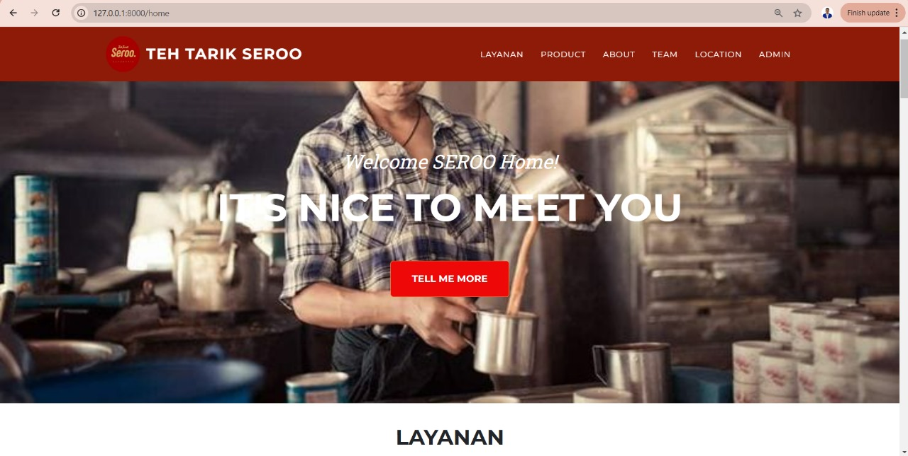

## BAB I Pendahuluan

## 1.1 Tujuan

Pembuatan website Business Profile UMKM Seroo, yang bergerak di bidang minuman teh tarik dengan berbagai rasa, adalah untuk memperkenalkan produk kepada masyarakat secara lebih luas dan memudahkan calon pelanggan dalam mengakses informasi tentang bisnis ini. Website ini bertujuan untuk meningkatkan visibilitas dan branding UMKM Seroo, sehingga dapat menarik perhatian konsumen potensial yang tertarik dengan inovasi rasa teh tarik yang ditawarkan. Selain itu, website ini juga berfungsi sebagai sarana komunikasi yang efisien antara pelanggan dan pengelola, menyediakan informasi terkait menu, lokasi, serta promosi yang sedang berlangsung. Dengan adanya website ini, diharapkan dapat mempermudah proses pemesanan dan memberikan kemudahan bagi pelanggan dalam menjelajahi berbagai pilihan produk, sehingga meningkatkan kepercayaan dan loyalitas konsumen terhadap merek Seroo

## 1.2 Lingkup
Website Business Profile UMKM Seroo adalah website yang memperkenalkan dan mempromosikan usaha minuman teh tarik dengan berbagai rasa yang khas dan inovatif yang mana, Website ini akan menyediakan informasi yang lengkap mengenai produk-produk yang ditawarkan oleh Seroo, termasuk berbagai varian rasa teh tarik yang unik dan segar, kepada para pelanggan dari bisnis UMKM Seroo.

## 1.3 Akronim, singkatan, definisi
| Istilah | Definisi |
| ------ | ------ |
|    Login    | Digunakan untuk mengakses aplikasi       |
|    Dashboard   | Tampilan antarmuka yang menyajikan informasi secara ringkas dan terorganisir, biasanya dalam bentuk grafik, tabel, atau indikator visual, untuk memudahkan pengguna    |
|    Admin   | (administrator) seseorang yang memiliki hak akses dan kontrol penuh terhadap Website Seroo  |
|    Use Case    | situasi dimana sistem digunakan untuk memenuhi satu atau lebih kebutuhan pemakaian anda       |

## 1.4 Referensi
Referensi yang digunakan dalam pengembangan Website ini adalah :

-https://teaattarik.com/

## 1.5 Overview
Bab selanjutnya yaitu menjelaskan sistem informasi yang di terapkan pada Website ini.  Menjelaskan gambaran dari website, dan alur sistemnya. Bab terakhir menjelaskan tentang setiap fungsi yang digunakan secara teknisnya. Pada bab 2 dan 3 merupakan deskripsi dari website yang akan diterapkan pada website seroo yang kami buat.

## BAB II GAMBARAN UMUM
Website bisnis profile UMKM Seroo dirancang untuk memberikan informasi yang lengkap dan menarik mengenai usaha minuman teh tarik yang menawarkan berbagai rasa. Website ini berfungsi sebagai platform utama untuk memperkenalkan produk unggulan dari Seroo, yang mengedepankan kualitas dan keunikan teh tarik dengan pilihan rasa yang variatif. Dalam tampilan awal, pengunjung akan disambut dengan desain yang modern dan ramah pengguna, menampilkan foto-foto produk yang menggugah selera, serta informasi tentang  filosofi di balik merek Seroo. Berikut akan kami jelaskan sistem software kami, pengunjung fungsi utama yaitu:

- View Beranda Seroo
- View Layanan Seroo
- View tentang Seroo
- View Team Seroo
- View location Seroo

Berikut ini fungsi admin yaitu:
- Login
- view Dashboard 
- View Pelanggan
- Input Data Product
- Input Data Mitra
- Input Data User
- Input Data Pelanggan
- Input Data Asset
- Input Data Kasir
- Save Data
- Update data
- Delete data
- Edit data

## 2.1 Perspektif produk
Website Seroo merupakan website yang diaplikasikan pada website dengan Terdapat 2 jenis aktor yaitu admin dan Pelanggan. Pengolahan informasi dan deskripsi product dilakukan oleh admin pada website dan Pelanggan hanya  dapat melihat informasi product pada website.

**2.1.1 Antarmuka Sistem**

Website Seroo memiliki 2 pengunjung yaitu admin dan Pelanggan. Admin mempunyai fungsi mengelola tampilan informasi dan juga menginputkan deksripsi mengenai product Seroo, Pelanggan bisa melihat Product, Layanan,Tentang, Team dan lokasi bisnis Seroo.

**2.1.2 Antarmuka Pengguna**

**Halaman Admin**
|  |  |
|--|--|
|  halaman login admin diminta untuk mengisi username dan password.
|  |  |
|  Setelah login admin akan masuk ke tampilan Dashboard admin.Pada halaman admin akan terdapat halaman Dashboard yang pertama kali muncul. Halaman Dashboard di gunakan untuk Admin dapat melihat total pelanggan, total user, total mitra, data pelanggan, Presentase kondisi aset, Pertumbuhan pelanggan, dan Product terbaru.
|  |  |
|  Pada halaman Mitra, Admin dapat melihat dan menambahkan data mitra.
|  |  |
|  Pada halaman User, Admin dapat melihat dan menambahkan data User.
|  |  |
|  Pada halaman Pelanggan, Admin dapat melihat dan menambahkan data pelanggan. 
|  |  |
|  Pada halaman Product, Admin dapat mengelola data Product, yang di mana admin dapat Memasukan Image Product, Memberikan keterangan Product dan Memberikan deskripsi Product. Pada halaman ini juga, admin dapat melakukan Delete product, Tambah Product, Edit Product dan menyimpan Product yang telah di perbarui oleh admin.
|  |  |
| Pada halaman asset, Admin dapat melihat dan menambahkan data asset. 
|  |  |
| Pada halaman asset, Admin dapat melihat dan menambahkan data asset.
|  |  |
|[alt text](Website_Image/admin_Kasir.png?raw=true) Pada halaman Kasir, Admin dapat melihat dan menambahkan data pelanggan seperti nama pelanggan, pesanan, tanggal pemesanan, jumlah pemesanan , total harga, dan metode pembayaran.
 

**Halaman User**
|  |  |
|--|--|
|  Pada halaman pelanggan terdapat langsung halaman home yang dapat di scrolling, yang mana halaman home berisi seluruh konten seperti layanan, Product , about , Team , Lokasi dan Admin..
|  |  |
|  Pada Halaman Layanan, Pengunjung dapat melihat layanan yang di berikan oleh Seroo.
|  |  |
|  Pada halaman Product, Pelanggan dapat melihat Product apa saja yang di berikan oleh seroo, dengan terdapat gambar, deskripsi product dan harga Product.
|  |  |
|  Pada halaman About, Pelanggan dapat melihat perjalanan dan Proses dari Bisnis Seroo.
|  |  |
|  Pada halaman Team, Pelanggan dapat melihat team Developer yang mengembangkan website dari Seroo.
|  |  |
|  Pada halaman Lokasi, Pelanggan dapat melihat OUTLET dari seroo, yang nantinya akan mengarahkan langsung ke maps.

**2.1.3 Antarmuka perangkat keras**

Antarmuka perangkat keras yang digunakan untuk mengoperasikan Sistem Informasi Seroo antara lain :

PC / Laptop Untuk menjalankan Aplikasi ini.

**2.1.4 Antarmuka perangkat lunak**

tidak ada

**2.1.5 Antarmuka Komunikasi**

Antarmuka komunikasi yang digunakan untuk mengoperasikan Perangkat Lunak Sistem Informasi Seroo lain :

- PC

- wifi/Jaringan

**2.1.6 Batasan Memori**

tidak ada

**2.1.7 Operasi-operasi**
| Operasi | Fungsi |
| ------ | ------ |
|   Login  | Digunakan untuk mengakses aplikasi    |
|    Input Product |    Digunakan untuk memasukkan informasi serta Gambaran mengenai Product   |
| Kembali |  Digunakan untuk kembali ke halaman sebelumnya |
| Hapus | Digunakan untuk menghapus data|
| Edit       |   Digunakan untuk mengubah data     |
| View      |   Digunakan untuk menampilkan data     |
| Simpan      |     Digunakan untuk menyimpan data   |

**2.1.1 Kebutuhan adaptasi**

tidak ada

## 2.2 Spesifikasi kebutuhan fungsional

**2.2.1 Admin Login**

Use Case: Login

Diagram:

Deskripsi Singkat 
Admin melakukan login terlebih dahulu sebelum masuk ke tampilan home admin, apabila gagal login akan muncul pesan alert error login. 

Deskripsi Langkah-Langkah
1. Admin melakukan login dengan username dan password.
2. Sistem melakukan validasi login.
3. Bila sukses sistem akan mengarahkan ke home admin.
4. Bila gagal sistem akan menampilkan peringatan.

Xref: Bagian 3.2.1, Login Admin

**2.2.2 Admin Input Product**

Use Case: Input Product

Diagram:

Deskripsi Singkat
Admin menginputkan gambar product lalu menambahkan judul dan deskripsi sesuain kategori.

Deskripsi Langkah- langkah:
1. Sistem akan menampilkan tampilan input Prodcut.
2. Admin Dapat melihat,menambahkan,menghapus dan mengupload Product.
3. Sistem akan menyimpan ke database.
4. Jika sudah disimpan sistem akan menampilkan ke halaman product.

Xref: Bagian 3.2.2, Input data Product

**2.2.3 Admin Input Mitra**

Use Case: Input Mitra

Diagram:

Deskripsi Singkat
Admin Menginput data Mitra.

Deskripsi Langkah- langkah:
1. Sistem akan menampilkan tampilan input Mitra.
2. Admin Dapat melihat,menambahkan dan menghapus Mitra.
3. Sistem akan menyimpan ke database.

Xref: Bagian 3.2.3, Input data Mitra

**2.2.4 Admin Input User**

Use Case: Input User

Diagram:

Deskripsi Singkat
Admin menginputkan Data User.

Deskripsi Langkah- langkah:
1. Sistem akan menampilkan tampilan input User.
2. Admin Dapat melihat,menambahkan dan menghapus User.
3. Sistem akan menyimpan ke database.

Xref: Bagian 3.2.4, Input data User

**2.2.5 Admin Input Pelanggan**

Use Case: Input Pelanggan

Diagram:

Deskripsi Singkat
Admin menginputkan data Pelanggan.

Deskripsi Langkah- langkah:
1. Sistem akan menampilkan tampilan input Pelanggan.
2. Admin Dapat melihat,menambahkan dan menghapus Pelanggan.
3. Sistem akan menyimpan ke database.

Xref: Bagian 3.2.5, Input data Pelanggan

**2.2.6 Admin Input Asset**

Use Case: Input Asset

Diagram:

Deskripsi Singkat
Admin menginputkan data Asset.

Deskripsi Langkah- langkah:
1. Sistem akan menampilkan tampilan data Asset.
2. Admin Dapat melihat,menambahkan dan menghapus data Asset .
3. Sistem akan menyimpan ke database.

Xref: Bagian 3.2.6, Input data Asset

**2.2.7 pengunjung Mengunjungi website**

Use Case: Mengunjungi website

Diagram:

Deskripsi Singkat 
pengunjung mengunjungi website dan melihat informasi mengenai bisnis Seroo

Deskripsi Langkah-Langkah
1. Sistem akan menampilkan halaman-halaman konten Seroo.
2. pengunjung melihat informasi yang ada pada website seperti informasi seputar layanan, Produk, Team dan Lokasi.

Xref: Bagian 3.2.7, Login pengunjung

## 2.3 Spesifikasi kebutuhan non-fungsional
- tabel kebutuhan non-fungsional

| no | deskripsi |
| ------ | ------ |
|     1   |   Semua interface dan fungsi menggunakan Bahasa Indonesia     |
|     2   |   Perangkat Lunak dapat dipakai di semua platofrm OS ( Admin, pelanggan)     |

## 2.4 Karakteristik Pengguna
Karakteristik pengguna dari perangkat lunak ini adalah pengguna langsung berinteraksi dengan sistem dan dihubungkan dengan hak akses atau level autentikasi.

## 2.5 Batasan-batasan
tidak ada

## 2.6 Asumsi-asumsi
tidak ada

## 2.7 Kebutuhan Penyeimbang
tidak ada

## BAB III Requirement Specification

## 3.1 Persyaratan Antarmuka Eksternal
Salah satu cara mengakses website ini yaitu dengan membuka website Seroo, lalu pelanggan dapat melihat profile dari Seroo.

## 3.2 Functional Requirement
**3.2.1 Login Admin**

| Nama Fungsi         | Login                                  |
| ------------------- | -------------------------------------- |
| Xref                | Bagian 2.2.1 Login               |
| Trigger             | Admin Membuka Website Sistem Informasi Seroo|
| Precondition        | Halaman login                          |
| Basic Path          | 1. Admin melakukan login dengan username dan password.
|        |         2.  Bila sukses, sistem akan mengarahkan ke home admin. |
|        | 3. Bila gagal, sistem akan menampilkan peringatan. |
|     Alternative       |                   Tidak Ada                   |
| Post Condition     |                  admin dapat login dan mengakses webiste sistem informasi Seroo                   |
|         Exception Push          |                  Username dan password salah                   |

**3.2.2 Admin Input Informasi Product Seroo*
| Nama Fungsi | Input Informasi Product Seroo |
| ------ | ------ |
| Xref       | Bagian 3.2.2, Input data Product Seroo    |
| Triger       | Membuka website sistem informasi admin Seroo     |
| Precondition | Menginput data dan gambar mengenai Seroo |
| Basic Path | 1. Sistem akan menampilkan tampilan input Product. |
|            | 2. Admin dapat melihat,menambahkan, menghapus dan menyimpan Product. |
|            | 3. Sistem akan menyimpan ke database. |
|            | 4. Jika sudah disimpan sistem akan menampilkan ke halaman Product. |
| Alternative | Tidak ada |     
| Post Condition | Admin mengelola Product
| Exception Push | Tidak ada koneksi |

**3.2.3 Admin Input data Mitra*
| Nama Fungsi | Input data Mitra dari Bisnis Seroo|
| ------ | ------ |
| Xref       | Bagian 3.2.3, Input data Mitra   |
| Triger       | Membuka website sistem informasi admin Seroo     |
| Precondition | Menginput data Mengenai Mitra Seroo |
| Basic Path | 1. Sistem akan menampilkan tampilan input Mitra. |
|            | 2. Admin dapat melihat,menambahkan, menghapus dan menyimpan Product. |
|            | 3. Sistem akan menyimpan ke database. |
| Alternative | Tidak ada |     
| Post Condition | Admin mengelola Mitra
| Exception Push | Tidak ada koneksi |

**3.2.4 Admin Input data Pelanggan*
| Nama Fungsi | Input data Pelanggan dari Bisnis Seroo|
| ------ | ------ |
| Xref       | Bagian 3.2.4, Input data Pelanggan    |
| Triger       | Membuka website sistem informasi admin Seroo     |
| Precondition | Menginput data Pelanggan |
| Basic Path | 1. Sistem akan menampilkan tampilan input Pelanggan. |
|            | 2. Admin dapat melihat,menambahkan, menghapus dan menyimpan data Pelanggan. |
|            | 3. Sistem akan menyimpan ke database. |
| Alternative | Tidak ada |     
| Post Condition | Admin mengelola Pelanggan
| Exception Push | Tidak ada koneksi |

**3.2.5 Admin Input data Asset*
| Nama Fungsi | Input Informasi Asset Bisnis Seroo |
| ------ | ------ |
| Xref       | Bagian 3.2.5, Input data Asset    |
| Triger       | Membuka website sistem informasi admin Seroo     |
| Precondition | Menginput data mengenai Asset |
| Basic Path | 1. Sistem akan menampilkan tampilan input Asset. |
|            | 2. Admin dapat melihat,menambahkan, menghapus dan menyimpan Asset. |
|            | 3. Sistem akan menyimpan ke database. |
| Alternative | Tidak ada |     
| Post Condition | Admin mengelola Asset
| Exception Push | Tidak ada koneksi |

**3.2.6 Admin Input data Penjualan*
| Nama Fungsi | Input data Penjualan Product Seroo|
| ------ | ------ |
| Xref       | Bagian 3.2.6, Input data Penjualan  |
| Triger       | Membuka website sistem informasi admin Seroo     |
| Precondition | Menginput data penjualan product seroo |
| Basic Path | 1. Sistem akan menampilkan tampilan input user. |
|            | 2. Admin dapat melihat,menambahkan, menghapus data penjualan Product Seroo. |
| Alternative | Tidak ada |     
| Post Condition | Admin mengelola Penjualan Product Seroo
| Exception Push | Tidak ada koneksi |

**3.2.7 Mengunjungi website**

| Nama Fungsi        |    pengunjung  Mengunjungi website             |
| ------------------- | ---------------------------------- |
| Xref               | Bagian 2.2.7 Pengunjung Mengunjungi website             |
| Trigger            |pengunjung Dapat mengunjungi website dan melihat informasi yang ada pada website seperti Layanan,Product,Team,Tentang dan lokasi|
| Precondition       |pengunjung Mengunjungi website |
| Basic Path         | 1. Sistem akan menampilkan halaman-halaman konten. |
|                    |  2.pengunjung melihat konten yang ada pada website seperti Layanan,Product,Team, Tentang dan Lokasi    |
| Alternative        |   Halaman Konten    |
| Post Condition     |   pengunjung mengunjungi website dan melihat informasi yang ada pada website     |
| Exception Push     |    Jika ada kesalahan server atau gangguan teknis, sisem tidak dapat di akses pengguna. Pengguna dapat mencoba kembali atau menghubungi dukungan teknis.    |

## 3.3 Struktur Detail Kebutuhan Non-Fungsional

**3.3.1 Logika Struktur Data**
Struktur data logika pada sistem informasi Seroo yang di jalankan melalui ERD.

**Tabel Admin**
|Data Item|Tipe Data|Deskripsi|
|--|--|--|
|Id_Admin|int|Auto-increment dari Id_user|
|username|varchar|Berisi username admin untuk mengakses sistem|
|Password|varchar|Berisi password admin untuk mengakses sistem|
|level|varchar|untuk membedakan level saat login antara admin dan pengunjung|

**Tabel Product**
|Data Item|Tipe Data|Deskripsi|
|--|--|--|
|id_Produk|int|Auto-increment dari Id_Product|
|nama_Produk|varchar|Berisi nama product di dalam halaman Produk|
|deskripsi|text|Berisi deskripsi product |
|kategori |enum('Makanan', 'Minuman', 'Other')|Berisi kategori pada halaman produk|
|harga|	decimal(15,2)|Berisi Harga product pada halaman Product|
|Stok| Int|Stok product di dalam halaman Product|
|Gambar|blob|Berisi gambar Product pada halaman product|
|created_at|timestamp|Berisi waktu pembuatan product pada halaman Product|
|updated_at|timestamp|Berisi waktu update product pada halaman Product|

**Tabel Mitra**
|Data Item|Tipe Data|Deskripsi|
|--|--|--|
|id_mitra|int|Auto-increment dari id_mitra|
|nama_mitra|varchar|Berisi nama mitra|
|alamat|text|Berisi alamat mitra |
|email |varchar|Berisi email dari mitra|
|no_tlp|varchar|Berisi nomor telefon mitra|
|Jenis_Mitra|enum('Platinum', 'Gold', 'Silver')|Jenis mitra yang bekerja sama dengan seroo|
|Tanggal_Bergabung|date|Berisi tanggal bergabung mitra|
|created_at|timestamp|Berisi waktu pembuatan mitra pada|
|updated_at|timestamp|Berisi waktu update mitra|

**Tabel User**
|Data Item|Tipe Data|Deskripsi|
|--|--|--|
|id|bigint|Auto-increment|
|nama_user|varchar|Berisi nama User|
|email |varchar|Berisi email dari user|
|password|varchar|Berisi password user|
|role|varchar||
|remember_token|varchar||
|created_at|timestamp|Berisi waktu pembuatan mitra pada|
|updated_at|timestamp|Berisi waktu update mitra|

**Tabel Pelanggan**
|Data Item|Tipe Data|Deskripsi|
|--|--|--|
|id_pelanggan|int|Auto-increment dari id_pelanggan|
|first_name|varchar|Berisi nama awal pelanggan|
|last_name|varchar|Berisi nama akhir pelanggan |
|birthday |date|Berisi tanggal ulang tahun pelanggan|
|gender|enum('Male', 'Female', 'Other')|Berisi Jenis Kelamin pelanggan|
|email|varchar|email pelanggan|
|Phone|varchar|Berisi Nomor telefon pelanggan|
|created_at|timestamp|Berisi waktu pembuatan pelanggan|
|updated_at|timestamp|Berisi waktu update pelanggan|

**Tabel Asset**
|Data Item|Tipe Data|Deskripsi|
|--|--|--|
|id_asset|int|Auto-increment dari id_asset|
|nama_asset|varchar|Berisi nama dari asset|
|kategori|enum('Mesin', 'Alat', 'Inventaris')|Berisi asset pelanggan |
|tanggal_pembelian|date|Berisi tanggal pembelian asset|
|tanggal_kadaluarsa|date|Berisi tanggal kadaluarsa asset|
|Status|enum('Aktif', 'Kadaluarsa', 'Maintenance')|Berisi status dari Jenis asset|
|created_at|timestamp|Berisi waktu pembuatan pelanggan|
|updated_at|timestamp|Berisi waktu update pelanggan|

**Tabel Penjualan**
|Data Item|Tipe Data|Deskripsi|
|--|--|--|
|id_Penjualan|int|Auto-increment dari id_Penjualan|
|tanggal_jual|datetime|Berisi tanggal dan waktu penjualan product seroo|
|jumlah_list |json|Berisi list penjualan dari product seroo |
|total_harga|int|Berisi total harga dari product seroo |
|Metode_pembayaran|	enum('QRIS', 'Transfer', 'Cash')|Berisi metode yang di gunakan untuk membayar product seroo|
|Catatan|Text|Berisi catatan dari penjualan product seroo|
|created_at|timestamp|Berisi waktu pembuatan penjualan|
|updated_at|timestamp|Berisi waktu update penjualan|

## Pembagian tugas
Pembuatan Website
Halaman Home -> Ninda + Ibrahim

Halaman Layanan -> Ibrahim
Halaman Product -> Ibrahim
Halaman Location -> Ibrahim
Halaman Admin -> Ibrahim + jelly + Ninda

Halaman Team -> Jelly + Ibrahim

Pembuatan Laporan
BAB 1 Pendahuluan -> Ninda

BAB 2 
2.1
  
  2.1.1 -> Jelly
  
  2.1.2 -> Ninda + Ibrahim
  
  2.1.3 -> Jelly
  
  2.1.4 -> Ninda
 
  2.1.5 -> Ninda
  
  2.1.6 -> Ninda
  
  2.1.7 -> Jelly
  
  2.1.8 -> Ninda

2.2 

 2.2.1 -> Ninda 
  
  2.2.2 -> Ninda
  
  2.2.3 -> Ninda
  
  2.2.4 -> Ninda
 
  2.2.5 -> Ninda
  
  2.2.6 -> Jelly
  
  2.2.7 -> Jelly
  
  2.2.8 -> Jelly

BAB 3 

3.1 Ibrahim + Ninda + Jelly

3.2 Ninda + Jelly
3.2.1 -> Ninda 
  
  2.2.2 -> Ninda
  
  2.2.3 -> Jelly
  
  2.2.4 -> Ibrahim
 
  2.2.5 -> Ibrahim
  
  2.2.6 -> Jelly
  
  2.2.7 -> Jelly

3.3 Jelly + Ibrahim

Pembuatan Diagram Pada Laporan: Jelly dan Ninda
Melakukan ScreenShoot Halaman Website:Ibrahim

